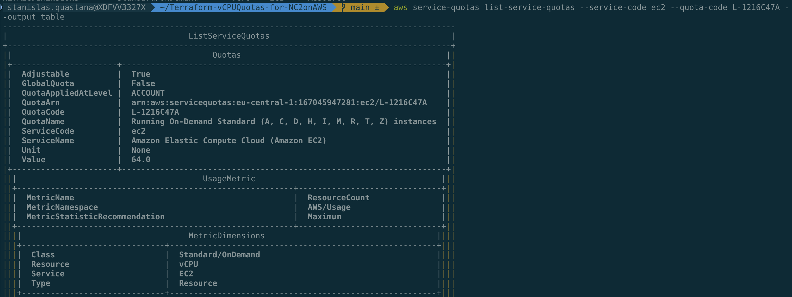

# Terraform-vCPUQuotas-for-NC2onAWS
A Terraform way to change AWS vCPU Quotas mandatory for Nutanix Cloud Clusters on AWS

To deploy a Nutanix Cloud Cluster in AWS, you need to have enough vCPU quotas for the choosen instance size.

The AWS Service Quotas console is a central location where you can view and manage your quotas for AWS services, and request a quota increase for many of the resources that you use. Use the quota information that we provide to manage your AWS infrastructure. Plan to request any quota increases in advance of the time that you'll need them.

You can have to configure a sufficient vCPU limit for your AWS account. Nutanix Cloud Cluster creation fails if you do not have the sufficient vCPU limit set for your AWS account.

AWS supports the following vCPU limits for the bare-metal instances available for NC2 on AWS.

- m6id.metal - 128 vCPUs for each instance
- m5d.metal: 96 vCPUs for each instance
- i3.metal: 72 vCPUs for each instance
- i3en.metal: 96 vCPUs for each instance
- i4i.metal - 128 vCPUs for each instance
- z1d.metal: 48 vCPUs for each instance
- g4dn metal: 96 vCPUs for each instance

To view / change the service quotas for your AWS you can use 

- the [AWS Service Quotas console](https://console.aws.amazon.com/servicequotas/home/services/ec2/quotas/)


- The AWS Command Line
    - Sample commands : https://docs.aws.amazon.com/cli/latest/userguide/cli_service-quotas_code_examples.html

    ```bash
    aws service-quotas list-service-quotas --service-code ec2 --quota-code L-1216C47A --output table

    ```

 


    Understanding the Output :
    The output will include several fields for each quota:
    - ServiceCode: Will be "ec2" for all results
    - ServiceName: "Amazon Elastic Compute Cloud (Amazon EC2)"
    - QuotaArn: The Amazon Resource Name for the quota
    - QuotaCode: A unique identifier for the quota
    - QuotaName: The name of the quota, which will include "vCPU" for relevant quotas
    - Value: The current quota value
    - Unit: The unit of measurement (typically "None" for vCPU counts)
    - Adjustable: Whether the quota can be increased upon request


- This sample of Terraform IaC Code can be use as is to change your quotas.

